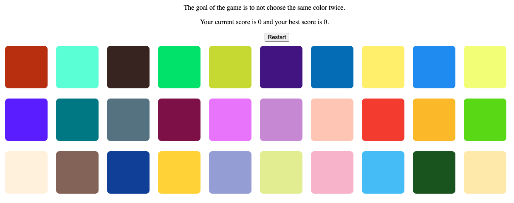

# memory-card

A memory game built with React, where you must not choose the same color twice. Every round randomizes the colors... how high can you get?

    

## Features

- Utilizes props, state, hooks, lifted state, component hierarchy, and lists.

## Demo

- https://cameronstamant.github.io/memory-card/
